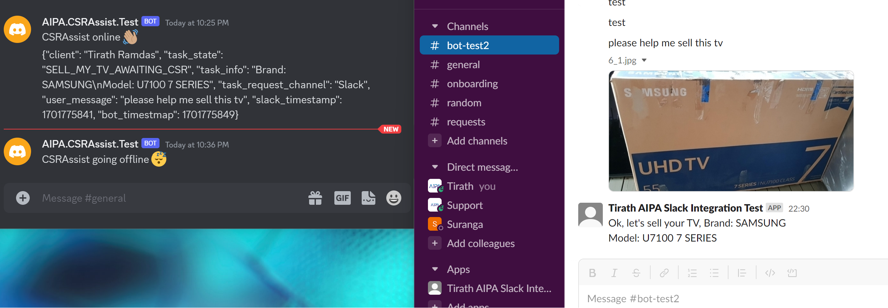

# CSRAssist
Tooling to assist CSRs

## Individual tools quickstart
* `poetry shell`
* `poetry install`
* Follow individual subdirectory quickstart steps

## Slack-Discord-Router PoC

(The following information is accurate up to 032cd495af775114194fb91f9cfc54cc968f9fbf)

To demonstrate the integration of Slack, Discord, and the ocr and stringlist seantics tools:

* Set up a slack bot and a discord bot with the guidance provided in `discord_integration/README.md` and `slack_integration/README.md`, add your bots to the relevant channels.
* Follow base README.md quickstart instructions, then proceed.
* In one console, `cd discord_integration && DISCORD_BOT_TOKEN=$(cat ~/secrets/aipa.csrassist.discord.test.token.txt) python discord_bot.py`
* In another console, `cd slack_integration && SLACK_BOT_TOKEN=$(cat ~/secrets/aipa.csrassist.slack.test.SLACK_BOT_TOKEN.txt) SLACK_SIGNING_SECRET=$(cat ~/secrets/aipa.csrassist.slack.test.SLACK_SIGNING_SECRET.txt) OPENAI_API_KEY=$(cat ~/secrets/openai.txt) python slack_bot.py`
* In yet another console, `ngrok http 3000`
* Copy the ngrok URL, navigate to [https://api.slack.com/](https://api.slack.com/) and open the Event Subscriptions tab for your app, and enter the ngrok URL in the Request URL field (don't forget the `/slack/events` suffix).
* Send a 'sell my tv' message in Slack.

