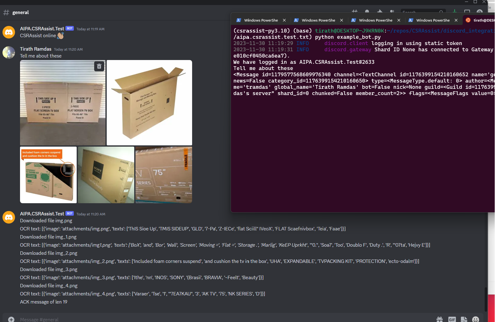

# Discord integration

(The following information is accurate up to a4c9961053489f32eb5e2fdeaf9bcd55030b959f)

`example_bot.py` is an example of Discord integration. This sample connects to a bot set up by
Tirath, deployed on a sample server set up by Tirath, for demonstration purposes.

The bot listens for messages on the Discord server and downloads any attachments included in a
message, and then attempts to extract any text contained within the image.

## Quickstart
* Follow base README.md quickstart instructions, then proceed.
* `DISCORD_BOT_TOKEN=$(cat ~/secrets/aipa.csrassist.test.txt) python example_bot.py`
