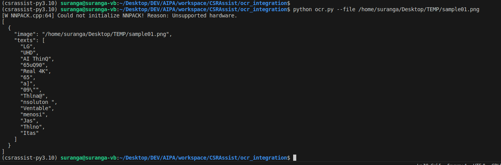

# OCR Integration
Extract text from image(s)



## Notes
EasyOCR does not support Python 3.12+ as of Nov 2023

## Quickstart
* Make sure to use Python `^3.10` up to `3.11.x`
* Follow base README.md quickstart instructions, then proceed

## Usage

### Console
`python ocr.py -f /path/to/image.png`

### Script
```
import ocr

image_path = ["/path/to/image.png"]
result = ocr.extract_text(images)
print(result)
```

Result:

```
[
  {
	"image": "/path/to/image.png",
	"texts": [
	  "LG",
	  "UHD",
	  "AI ThinQ"
	]
  }
]
```
  
