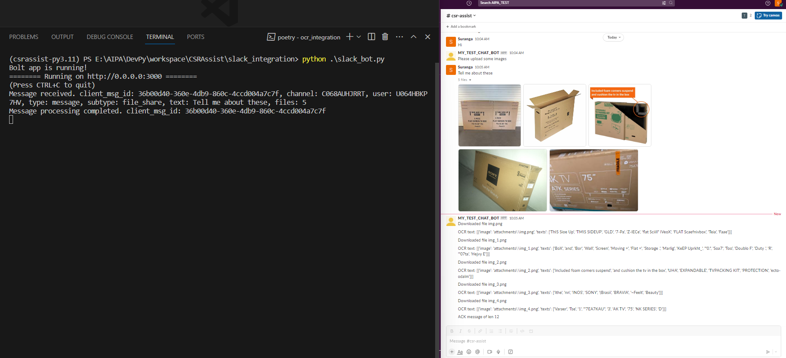

# Slack integration

The bot listens for messages on the Slack channels and downloads any attachments included in a
message, and then attempts to extract any text contained within the image.

## Quickstart
* Follow base README.md quickstart instructions, then proceed.
* `$ SLACK_BOT_TOKEN=<Slack Bot Token>`
* `$ SLACK_SIGNING_SECRET=<Slack Signing Secret>`
* `$ python slack_bot.py`

## Setup Slack App/Bot in Slack workspace

1.	Go to https://api.slack.com/apps
2.	click "Create an App"
3.	Select "From Sctratch", Provide a name (Ex: "CSRAssist.Bot") and pick a workspace where you can create a channel to test your bot.
4.	Go to "Feature" > "OAuth & Permissions"
5.	Click "Add an OAuth Scope" under "Scopes" > "Bot Token Scopes"
6.	Add "chat:write" scope
7.	Click on "Install to Workspace" under "OAuth Tokens for Your Workspace"
8.	Click "Allow" to add permissions
9.	Copy the Bot Token (i.e.`SLACK_BOT_TOKEN`) under "OAuth Tokens for Your Workspace" > "Bot User OAuth Token"
	    Note: You can any other permission you need
10. Go to "Settings" > "Basic Information" > "App Credentials"
11. Copy the Signing Secret (i.e. `SLACK_SIGNING_SECRET`)
12. Start your slack application locally by providing `SLACK_BOT_TOKEN` and `SLACK_SIGNING_SECRET`
      * It will start on port 3000 bt default
    
14. Download ngrok and start it on the same port your slack applition started 
      * Ex: `ngrok http 3000`
      * In the console, ngrok will print a dynamically assigned public domain URL for port forwarding
      * Ex: https://90e9-111-223-146-131.ngrok.io
	
16. Go back to slack app page again. i.e. https://api.slack.com/apps
      * Pick your Slack Application from the drop down, of you have multiple apps created

17. Click "Event Subscriptions" under "Feature"
18. Check "Enable Events"
19. Provide the "Request URL" in the following format
      * `https://{slack-application-domain}/slack/events`
      * Ex: https://90e9-111-223-146-131.ngrok.io/slack/events
	    
      * Once you click outside, it will start to verify the URL
      * If the URL is not verified, try it again and/or generate another URL via ngrok and provide the new URL with the correct format
	
20. Scroll down and add "Bot User Events" under "Subscribe to bot events"
21. Select "message:channels" event from the dropdown
22. Click "Save Changes"
23. Click "Install Apps" under "Settings"
24. Click "Reinstall to Workspace"
25. Click "Allow"
26. Go to your Slack workspace
27. Click on your Slack Bot/App you just created under "Apps" from the left panel
28. Click down arrow to open the Details window
29. Click "Add this app to a channel"
30. Select a channel and click "Add"
31. Go to the channel and say "Hi"
32. If your slack application is running, it will reply as "Please upload some images"
        * Please note that these responses may change in the future
	
#### Recurring configurations: 
If you dont have a paid ngrok, most probably you will have update the ngork URL each time
Therefore you have to do the following in order to update the formwarding URL

1. 	Go to https://api.slack.com/apps
2. 	Select your App
3. 	Click "Event Subscriptions" under "Feature"
4. 	Provide the new "Request URL"
5. 	Click "Install Apps" under "Settings"
6. 	Click "Reinstall to Workspace"
7. 	Click "Allow"
